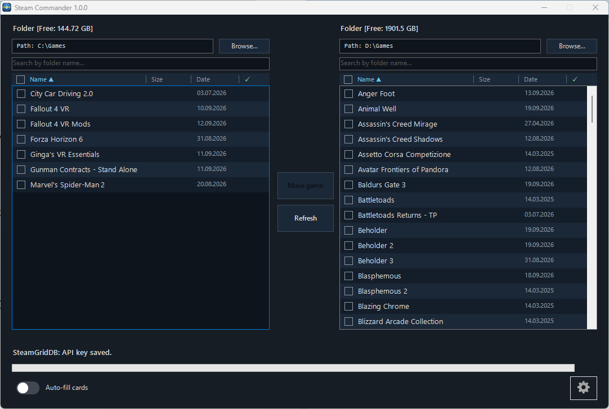
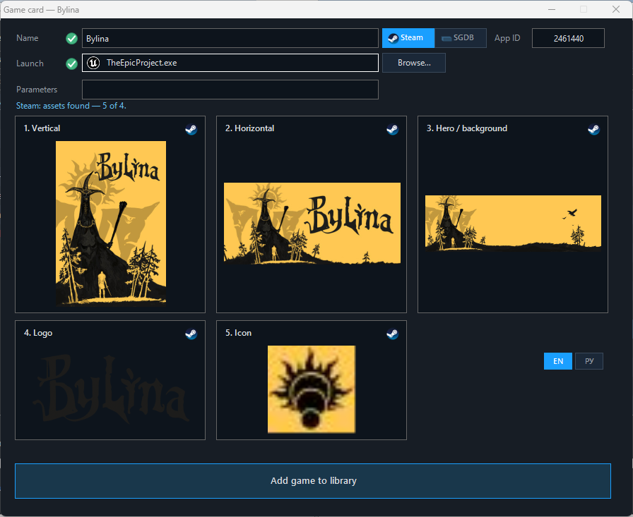
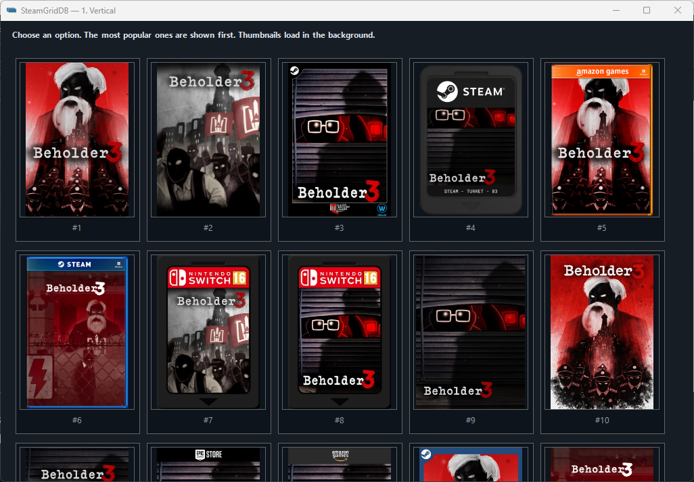
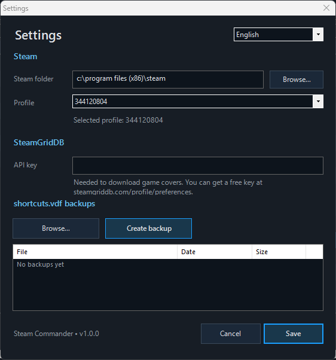

<div align="center">


# Steam Commander

**Convenient, fast and automatic way to add non-Steam games to your Steam library — with auto-detected exe and launch options, covers from multiple sources (localized where available), and a two-panel mode for moving game folders with Steam paths updated automatically.**


[](https://github.com/Hetfield1985/Steam-Commander/releases)
---
[](https://github.com/Hetfield1985/Steam-Commander/releases/latest)

**English** · [Русский](README.ru.md)

</div>

<p align="center">
  
</p>

## Screenshots

<p align="center">
  
</p>

<p align="center">
  
</p>

<p align="center">
  
</p>

<p align="center">
  
</p>
---


## What it does

Steam Commander is a Windows Forms desktop tool written in PowerShell. You point it at one or two folders that contain your games (for example a big HDD and a fast SSD), and it helps you:

- **Add non-Steam games to Steam** — with the correct title, executable, start folder, launch parameters and full set of artwork, instead of a blank shortcut.
- **Keep artwork right** — official Steam covers where they exist, [SteamGridDB](https://www.steamgriddb.com/) as an alternative source.
- **Move games between two folders/drives** — files are moved with progress and the Steam shortcut is updated to the new path.
- **Stay safe** — back up and restore `shortcuts.vdf` at any time.

## Features

**Library view**
- Two independent panels, each pointed at any folder.
- Search by folder name, sorting, and folder size calculation.
- Free-space indicator per drive and a marker for games that are already in your Steam library.
- Columns for size, date and the in-library flag; click a header to sort.

**Adding games**
- Game card with title, executable, start folder and launch parameters.
- Four artwork slots: **vertical**, **horizontal**, **hero/background**, **logo** — each with a live preview and a source badge (Steam / SteamGridDB).
- Title and executable confidence indicators (green check when the match is reliable).
- Executable detection with junk filtering (uninstallers, crash handlers, redistributables, …) and a hint from Steam's own launch data.
- Launch parameters suggested from Steam data, with human-readable descriptions for well-known options.
- **Batch mode** for many games at once, with optional **auto-fill**: confidently recognised games are added without opening a card; the card opens only for games the program could not identify unambiguously.
- Steam **cover region** selection (localised artwork).

**Moving games**
- Move ticked games from one panel folder to the other with progress, speed and free-space check.
- Steam shortcuts are rewritten to point at the new location.

**Safety**
- Manual backup and restore of `shortcuts.vdf` (Steam is closed and restarted automatically around a restore).
- Removing a game from a panel list never touches files on disk.

**Interface**
- Six languages: Русский, English, 简体中文, Español, Português (Brasil), Deutsch.
- Keyboard-friendly: see [Keyboard shortcuts](#keyboard-shortcuts).

## Requirements

- Windows 10 or 11.
- Windows PowerShell 5.1 (built in) — only needed if you run the `.ps1` directly.
- Steam installed and started at least once (so a `userdata` profile exists).
- **Administrator rights** — the program asks for them and exits without.
- Internet access for game search and artwork (see [Privacy and network](#privacy-and-network)).
- Optional (but highly recommended): a free [SteamGridDB API key](https://www.steamgriddb.com/profile/preferences) for the SteamGridDB source.

## Installation

### Option A — download the executable
1. Open the [Releases](../../releases) page and download `Steam Commander.exe`.
2. Put it in any folder and run it (it requests administrator rights).

### Option B — run the script
```powershell
# from an elevated PowerShell window
powershell -ExecutionPolicy Bypass -File .\src\Steam_Commander.ps1
```

### Option C — build the executable yourself
See [Building](#building).

## Getting started

1. Launch Steam Commander and open **Settings**. Check the Steam folder and pick the Steam **profile** (`userdata`) you want to work with.
2. *((Optional but highly recommended))* Paste your SteamGridDB API key. A status message under the field tells you whether the key is valid, revoked, or the service is unavailable.
3. Choose a game folder for panel **C** and, if you want to move games between drives, another one for panel **D**.
4. Tick the games you want and press **Add selected games to library**, or open a single game card with double-click / Enter.
5. Check the title, executable and artwork, then save.

> **Note:** when the program writes to `shortcuts.vdf` it closes Steam and starts it again afterwards. Close running games and let Steam finish syncing first.

## Keyboard shortcuts

Both game panels share the same keys.

| Key | Action |
|---|---|
| Double-click / **Enter** | Open the game card |
| **Space** | Show folder size |
| **Delete** | Remove selected games from the list (files on disk are untouched) |
| **Ctrl+A** | Select all |
| **Esc** | Close the current game card (same as *Cancel*) |

The **Refresh** button brings removed rows back.

## Where data is stored

| What | Where |
|---|---|
| Settings (`config.ini`), cover-source metadata | `%APPDATA%\Steam Commander` |
| `shortcuts.vdf` backups (default) | `backups` folder next to the executable — can be changed in Settings |
| Temporary covers | `%TEMP%\SteamCommander` (removed when the program closes) |
| Steam shortcuts and artwork | your Steam profile: `Steam\userdata\<id>\config\shortcuts.vdf` and `config\grid\` |

Your SteamGridDB API key is stored **in plain text** in `config.ini`. Do not share that file.

## Privacy and network

There is no telemetry. The program only contacts services needed for its job:

- `store.steampowered.com`, `api.steampowered.com` and the `*.steamstatic.com` CDNs — game search and official artwork.
- `api.steamcmd.net` — Steam launch data (executable and launch options hints).
- `www.steamgriddb.com` — alternative artwork (only with your API key).

## Building

The executable is produced with [ps2exe](https://github.com/MScholtes/PS2EXE):

```powershell
Install-Module ps2exe -Scope CurrentUser   # once
.\build\build.ps1
```

The result is `dist\Steam Commander.exe`, with the icon, version and administrator manifest applied. The version is read from `$global:appVersion` in the script, so it always matches the source.

A GitHub Actions workflow (`.github/workflows/release.yml`) builds and attaches the executable to a release whenever you push a tag such as `v1.0.0`.

## Project structure

```
Steam-Commander/
├── src/Steam_Commander.ps1      # the whole application
├── build/build.ps1              # ps2exe build script
├── assets/icon/                 # application icon (.ico, 1024 px and 4096 px PNG)
├── .github/                     # issue templates, release workflow
├── CHANGELOG.md
├── CONTRIBUTING.md
└── LICENSE
```

## Known limitations

- For some games (especially very new or obscure ones) Steam's CDN has no vertical/capsule artwork. SteamGridDB is then the fallback, which needs an API key.
- Game title matching is heuristic. The confidence indicators in the game card show when a manual check is a good idea.
- Only Windows is supported.

## Contributing

Bug reports and pull requests are welcome — see [CONTRIBUTING.md](CONTRIBUTING.md).

## Disclaimer

Steam Commander is an unofficial community tool. It is not affiliated with, endorsed by or sponsored by Valve Corporation. *Steam* and the Steam logo are trademarks of Valve Corporation. Artwork shown in the program comes from Steam and SteamGridDB and belongs to its respective owners. The application icon is an original design.

Use at your own risk: the program edits Steam's `shortcuts.vdf`. Create a backup from the Settings dialog before your first bulk operation.

## License

[MIT](LICENSE)
