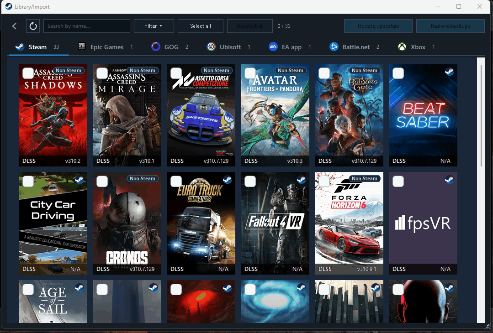

<p align="center">
  
</p>

# Steam Commander

**Add non-Steam games and ROMs to Steam, import libraries from Epic / GOG / Ubisoft / EA / Battle.net / Xbox, set covers (official Steam ones or custom ones from SteamGridDB), configure launch options, update DLSS / FSR / XeSS / XeLL, and move games between different locations in a convenient two-panel view — all in one program.**


[](https://github.com/Hetfield1985/Steam-Commander/releases)

---

[](https://github.com/Hetfield1985/Steam-Commander/releases/latest)

[](https://donatty.com/vitalibabinok) [](https://destream.net/live/VitaliBabinok) [](https://boosty.to/babinok/donate) [](#support)

[Русский](README.ru.md) · **English**

---

## Features

### Adding games to Steam

Add non-Steam games to your Steam library with automatic detection of the game title and EXE file, a convenient choice of officially available launch options (or your own), and a full set of covers from two selectable sources (Steam + SteamGridDB). Batch adding auto-fills everything the program is confident about and asks you only for the data it could not determine reliably. A built-in Steam game title database is used for more accurate search; it contains all games as of the program's creation. For accurate search of newer games, it is recommended to get your own Steam Web API key and enter it in the program (see Settings for details).


### Importing from launchers

Epic Games, GOG Galaxy, Ubisoft Connect, EA App, Battle.net, Xbox. Import the selected games into Steam (manually or automatically). Cover customization is available here as well. Games are started through the program's own silent launcher, which makes sure the third-party launcher starts in silent mode, passes focus to the game, and closes the third-party launcher after the game exits — it feels like playing a Steam game rather than running it through a separate launcher.


### Automatic import

For those who want to save time: with auto-import enabled, you can add huge numbers of games very quickly without taking part in the process. You only need to clarify the data the program could not determine with confidence.


### Adding ROMs with emulator selection

The panels show folders and ROM files filtered by the extensions of the active emulator. Includes an emulator manager, RetroArch support with core selection, archives (zip, 7z, rar, etc.) unpacked to a temporary folder, and custom emulator parameters (for example, to launch in fullscreen mode).


### Updating and managing upscaler libraries

Download and choose versions of DLSS / FSR / XeSS / XeLL. Replace the libraries in selected games, or in all added games, with a single button. Originals are saved as `.sc_orig` and can be restored in one action.



### Two-panel browser

Two independent panels (any folders / drives). Search, sorting, folder sizes, and an "already in Steam" mark with the game's icon. Move game and ROM folders between panels with progress display and automatic updating of Steam shortcuts. Smart two-way moving between folders/drives: select games in both panels at once and press Space to check whether the move is possible.


### Library editing

Edit non-Steam games, ROMs, and licensed Steam games (covers, launch options). Automatic and manual backup and restore of `shortcuts.vdf` (the file that stores the library of third-party games).


---

## System requirements

- Windows 10 or 11
- Windows PowerShell 5.1 (only when running the `.ps1`)
- Steam installed (launched at least once)
- **Administrator rights**
- Internet — for game search, covers, and downloading upscalers
- Optional but recommended: a [Steam Web API key](https://steamcommunity.com/dev/apikey), and a [SteamGridDB API key](https://www.steamgriddb.com/profile/preferences) is strongly recommended for choosing custom covers
- For ROM archives: 7-Zip (the program can offer to download it)

---

## Installation

### Ready-made exe

1. Download `Steam Commander.exe` from the [Releases](https://github.com/Hetfield1985/Steam-Commander/releases) page
2. Run it (the program will request administrator rights)

### Script

```powershell
# PowerShell as administrator
powershell -ExecutionPolicy Bypass -File .\src\Steam_Commander.ps1
```

### Building the exe

```powershell
Install-Module ps2exe -Scope CurrentUser   # once
.\build\build.ps1
```

The result is `dist\Steam Commander.exe`.

---

## Initial setup

1. Open **Settings** → specify the Steam folder and the `userdata` profile
2. *(Optional)* Add your Steam Web API and SteamGridDB API keys
3. If needed, add emulators and download upscaler libraries in the program settings
4. Add emulator profiles, specifying the exe

> When writing to `shortcuts.vdf`, the program closes Steam and starts it again. Close your games and wait for Steam to finish syncing before the operation.

---

## Hotkeys

| Key                        | Action                                                                                        |
| -------------------------- | --------------------------------------------------------------------------------------------- |
| Double-click / **Enter**   | Open the game card                                                                            |
| **Space**                  | Folder sizes of the selected games, and check whether they can be moved between panels        |
| **Ctrl+A**                 | Select all folders and files in the panel                                                     |
| **Esc**                    | Close the game card                                                                           |
| **Alt+Shift+Enter**        | Sizes of all folders in the panel                                                             |
| **F5**                     | Refresh the panels / library window                                                           |

---

## Where data is stored

| What                              | Where                                          |
| --------------------------------- | ---------------------------------------------- |
| Settings, emulator profiles       | `%APPDATA%\Steam Commander`                    |
| Steam games database              | `%APPDATA%\Steam Commander\steam_apps_db.json` |
| Upscaler libraries                | `%APPDATA%\Steam Commander`                    |
| Language files                    | `%APPDATA%\Steam Commander\lang`               |
| `shortcuts.vdf` backups           | `backups` folder next to the exe               |
| Temporary files                   | `%TEMP%\SteamCommander`                        |
| Steam shortcuts and covers        | `Steam\userdata\<id>\config\`                  |

API keys are stored in plain text in `config.ini` — do not share this file.

---

## Privacy and network

No telemetry. The program connects only to:

- `store.steampowered.com`, `api.steampowered.com`, `*.steamstatic.com`
- `api.steamcmd.net`
- `www.steamgriddb.com` (if a key is provided)
- DLSS Swapper upscaler library sources

---

## Project structure

```
Steam-Commander/
├── src/Steam_Commander.ps1
├── build/build.ps1
├── assets/icon/
├── .github/
├── CHANGELOG.md
├── CONTRIBUTING.md
└── LICENSE
```

---

## Known limitations

- Steam covers may be missing for new or little-known games — searching the SteamGridDB databases helps
- Title matching is heuristic; confidence indicators show when the data should be checked manually
- Importing from launchers depends on the data format of each specific launcher
- Windows only

---

## Contributing

Bug reports and pull requests are welcome — see [CONTRIBUTING.md](CONTRIBUTING.md).
You can also add language files to the `lang` folder.

---

## Disclaimer

Steam Commander is an unofficial community project. It is not affiliated with Valve Corporation.
*Steam* and the Steam logo are trademarks of Valve Corporation.
Covers belong to their respective owners. The application icon is an original design.

The program modifies `shortcuts.vdf` and may replace upscaler DLLs. Use at your own risk. Create a backup before mass operations.

---

## License

[MIT](LICENSE)

---

## Support

If you found the program useful:

- [Donatty](https://donatty.com/vitalibabinok)
- [DeStream](https://destream.net/live/VitaliBabinok)
- [Boosty](https://boosty.to/babinok/donate)

**USDT** (minimum 5 USDT):

- ERC-20: `0x2503cdb205ac6e41222e114d77b0dcc48ed83686`
- TRC-20: `TSE4BZQC6h9qES2QsgJjcfyDbGYNDATSv4`
- BEP-20: `0x2503cdb205ac6e41222e114d77b0dcc48ed83686`

Send only via the specified network. Transfers under 5 USDT or via a different network will be lost.
