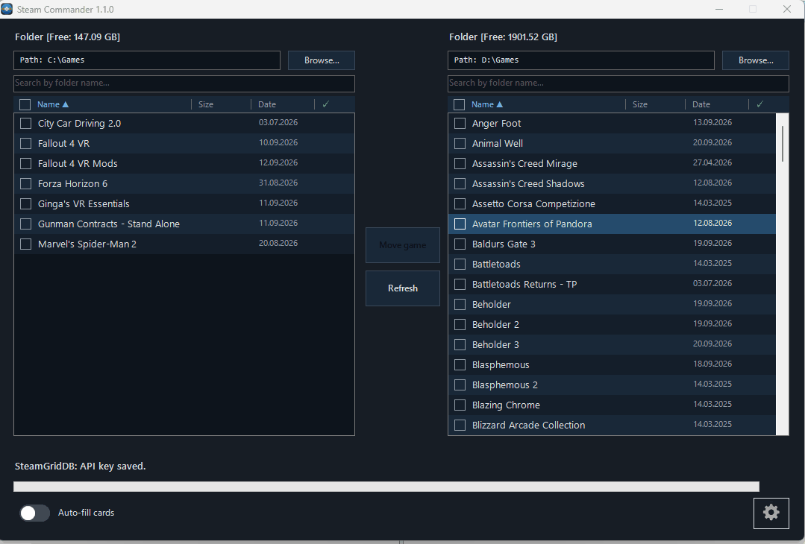

<div align="center">


# Steam Commander

**Удобный, быстрый и автоматический способ добавлять сторонние игры в библиотеку Steam — с автоматическим определением exe и параметров запуска, обложками из нескольких источников (с локализацией, где она доступна) и двухпанельным режимом для перемещения папок игр с автоматическим обновлением путей Steam.**


[](https://github.com/Hetfield1985/Steam-Commander/releases)

---

[](https://github.com/Hetfield1985/Steam-Commander/releases/latest)

<p align="center">
  <a href="https://donatty.com/vitalibabinok"></a>
  <a href="https://destream.net/live/VitaliBabinok"></a>
  <a href="https://boosty.to/babinok/donate"></a>
  <a href="#поддержка"></a>
</p>

<p align="center">
  <b>Русский</b> · <a href="README.md">English</a>
</p>

---

</div>

<p align="center">
  
</p>

<p align="center">
  
</p>

## Скриншоты

<p align="center">
  
</p>

<p align="center">
  
</p>

<p align="center">
  
</p>

<p align="center">
  
</p>

---

## Что умеет программа

Steam Commander — это приложение для Windows Forms, написанное на PowerShell. Вы указываете одну или две папки с играми (например, большой HDD и быстрый SSD), а программа помогает:

- **Добавлять сторонние игры в Steam** — с правильным названием, исполняемым файлом, рабочей папкой, параметрами запуска и полным набором обложек вместо пустого ярлыка.
- **Правильно подбирать обложки** — официальные обложки Steam, где они доступны, и [SteamGridDB](https://www.steamgriddb.com/) как альтернативный источник.
- **Перемещать игры между двумя папками/дисками** — файлы перемещаются с отображением прогресса, а ярлык Steam автоматически обновляется на новый путь.
- **Сохранять безопасность** — в любой момент создавать резервную копию и восстанавливать `shortcuts.vdf`.

## Возможности

**Библиотека**
- Две независимые панели, каждая может быть привязана к любой папке.
- Поиск по имени папки, сортировка и расчёт размера игр.
- Индикатор свободного места на диске и отметка игр, которые уже находятся в библиотеке Steam.
- Колонки размера, даты и наличия в библиотеке; сортировка по нажатию на заголовок.

**Добавление игр**
- Карточка игры с названием, исполняемым файлом, рабочей папкой и параметрами запуска.
- Четыре слота обложек: **вертикальная**, **горизонтальная**, **hero/фон**, **логотип** — каждый с предварительным просмотром и значком источника (Steam / SteamGridDB).
- Индикаторы уверенности определения названия и EXE (зелёная галочка при надёжном совпадении).
- **Интеграция со Steam Web API** для более точного определения названий игр и App ID, с сохранением названий и App ID в локальную базу для более быстрого поиска.
- Автоматический поиск исполняемых файлов с фильтрацией мусорных EXE (деинсталляторы, обработчики сбоев, redistributable и т. п.) и подсказками из собственных данных Steam.
- Подбор параметров запуска из данных Steam с понятными описаниями известных параметров.
- **Пакетный режим** для добавления сразу нескольких игр с необязательным **автозаполнением**: уверенно распознанные игры добавляются без открытия карточки, а карточка открывается только для игр, которые программа не смогла однозначно определить.
- Выбор **региона обложек Steam** (локализованные обложки).
- **Фильтр EXE** с возможностью включать игровые лаунчеры в список предлагаемых исполняемых файлов.

**Перемещение игр**
- Перемещение отмеченных игр из одной панели в другую с прогрессом, скоростью и проверкой свободного места.
- Ярлыки Steam переписываются с учётом нового расположения игры.

**Безопасность**
- Ручное резервное копирование и восстановление `shortcuts.vdf` (при восстановлении Steam автоматически закрывается и запускается заново).
- Удаление игры из списка панели никогда не удаляет файлы с диска.

**Интерфейс**
- Шесть языков: Русский, English, 简体中文, Español, Português (Brasil), Deutsch.
- Управление с клавиатуры: см. [Горячие клавиши](#горячие-клавиши).

## Системные требования

- Windows 10 или 11.
- Windows PowerShell 5.1 (встроен в Windows) — требуется только при непосредственном запуске `.ps1`.
- Steam должен быть установлен и хотя бы один раз запущен (чтобы существовал профиль `userdata`).
- **Права администратора** — программа запрашивает их и завершает работу без них.
- Доступ в интернет для поиска игр и загрузки обложек (см. [Конфиденциальность и сеть](#конфиденциальность-и-сеть)).
- Необязательно: бесплатный **Steam Web API ключ** для более точного определения названий игр и App ID.
- Необязательно (но настоятельно рекомендуется): бесплатный [SteamGridDB API ключ](https://www.steamgriddb.com/profile/preferences) для источника SteamGridDB.

## Установка

### Вариант A — скачать готовый exe
1. Откройте страницу [Releases](../../releases) и скачайте `Steam Commander.exe`.
2. Поместите его в любую папку и запустите (программа запросит права администратора).

### Вариант B — запустить скрипт
```powershell
# из PowerShell, запущенного от имени администратора
powershell -ExecutionPolicy Bypass -File .\src\Steam_Commander.ps1
```

### Вариант C — самостоятельно собрать exe
См. раздел [Сборка](#сборка).

## Первоначальная настройка

1. Запустите Steam Commander и откройте **Настройки**. Проверьте папку Steam и выберите нужный **профиль** Steam (`userdata`).
2. *(Необязательно)* Добавьте **Steam Web API ключ** для более точного определения названий игр и App ID. Названия игр и App ID загружаются и сохраняются в локальную базу для более быстрого последующего поиска.
3. *(Необязательно, но настоятельно рекомендуется)* Добавьте **SteamGridDB API ключ** для дополнительных обложек. Сообщение под полем показывает, действителен ли ключ, отозван ли он или сервис недоступен.
4. Выберите папку с играми для левой панели и, если хотите перемещать игры между дисками, ещё одну папку для правой панели.
5. Отметьте нужные игры и нажмите **Добавить выбранные игры в библиотеку** либо откройте карточку отдельной игры двойным щелчком / клавишей Enter.
6. Проверьте название, исполняемый файл и обложки, затем сохраните.

> **Примечание:** при записи данных в `shortcuts.vdf` программа закрывает Steam и запускает его снова после завершения операции. Перед этим закройте запущенные игры и дождитесь завершения синхронизации Steam.

## Горячие клавиши

Для обеих панелей игр используются одинаковые клавиши.

| Клавиша | Действие |
|---|---|
| Двойной щелчок / **Enter** | Открыть карточку игры |
| **Space** | Показать размер папки |
| **Delete** | Удалить выбранные игры из списка (файлы на диске не затрагиваются) |
| **Ctrl+A** | Выбрать всё |
| **Esc** | Закрыть текущую карточку игры (аналогично *Отмена*) |
| **Alt+Shift+Enter** | Посчитать размер всех папок активной панели |

Кнопка **Обновить** возвращает удалённые из списка строки.

## Где хранятся данные

| Что | Где |
|---|---|
| Настройки (`config.ini`), метаданные источников обложек | `%APPDATA%\Steam Commander` |
| База игр Steam | `%APPDATA%\Steam Commander` |
| Резервные копии `shortcuts.vdf` (по умолчанию) | папка `backups` рядом с exe — путь можно изменить в настройках |
| Временные обложки | `%TEMP%\SteamCommander` (удаляются при закрытии программы) |
| Ярлыки Steam и обложки | профиль Steam: `Steam\userdata\<id>\config\shortcuts.vdf` и `config\grid\` |

Ключи **Steam Web API** и **SteamGridDB API** хранятся **в открытом виде** в `config.ini`. Не передавайте этот файл другим людям.

## Конфиденциальность и сеть

Телеметрии нет. Программа обращается только к сервисам, необходимым для её работы:

- `store.steampowered.com`, `api.steampowered.com` и CDN `*.steamstatic.com` — поиск игр и официальные обложки.
- `api.steamcmd.net` — данные Steam о запуске (исполняемый файл и подсказки по параметрам запуска).
- `www.steamgriddb.com` — дополнительные обложки (при наличии SteamGridDB API ключа).

**Steam Web API** используется для загрузки названий игр и App ID в локальную базу, если настроен Steam Web API ключ.

## Сборка

Исполняемый файл создаётся с помощью [ps2exe](https://github.com/MScholtes/PS2EXE):

```powershell
Install-Module ps2exe -Scope CurrentUser   # один раз
.\build\build.ps1
```

Результат — `dist\Steam Commander.exe`, с применёнными иконкой, версией и манифестом администратора. Версия берётся из `$global:appVersion` в скрипте, поэтому она всегда совпадает с версией исходника.

GitHub Actions workflow (`.github/workflows/release.yml`) собирает и прикрепляет exe к релизу при отправке тега вроде `v1.0.0`.

## Структура проекта

```text
Steam-Commander/
├── src/Steam_Commander.ps1      # всё приложение целиком
├── build/build.ps1              # скрипт сборки ps2exe
├── assets/icon/                 # иконка приложения (.ico, PNG 1024 и 4096 px)
├── .github/                     # шаблоны issue и workflow релизов
├── CHANGELOG.md
├── CONTRIBUTING.md
└── LICENSE
```

## Известные ограничения

- Для некоторых игр (особенно очень новых или малоизвестных) CDN Steam не содержит вертикальных/капсульных обложек. В этом случае используется SteamGridDB, для которого требуется API ключ.
- Сопоставление названий игр выполняется эвристически. Индикаторы уверенности в карточке игры показывают, когда стоит проверить результат вручную.
- Поддерживается только Windows.

## Участие в разработке

Сообщения об ошибках и pull request приветствуются — см. [CONTRIBUTING.md](CONTRIBUTING.md).

## Отказ от ответственности

Steam Commander — неофициальный проект сообщества. Он не связан с Valve Corporation, не одобрен и не спонсируется Valve Corporation. *Steam* и логотип Steam являются товарными знаками Valve Corporation. Обложки, отображаемые в программе, принадлежат соответствующим владельцам. Иконка приложения является оригинальным дизайном.

Используйте программу на свой страх и риск: приложение изменяет `shortcuts.vdf`. Перед первой массовой операцией создайте резервную копию через окно настроек.

## Лицензия

[MIT](LICENSE)

## Поддержка

Если Steam Commander оказался вам полезен, вы можете поддержать его разработку:

- [Donatty](https://donatty.com/vitalibabinok)
- [DeStream](https://destream.net/live/VitaliBabinok)
- [Boosty](https://boosty.to/babinok/donate)

**USDT** (минимум 5 USDT):

- Сеть ERC-20:

  ```
  0x2503cdb205ac6e41222e114d77b0dcc48ed83686
  ```

- Сеть TRC-20:

  ```
  TSE4BZQC6h9qES2QsgJjcfyDbGYNDATSv4
  ```

- Сеть BEP-20:

  ```
  0x2503cdb205ac6e41222e114d77b0dcc48ed83686
  ```

Отправляйте USDT только через указанную рядом с адресом сеть. Переводы менее 5 USDT или через другую сеть будут потеряны.
