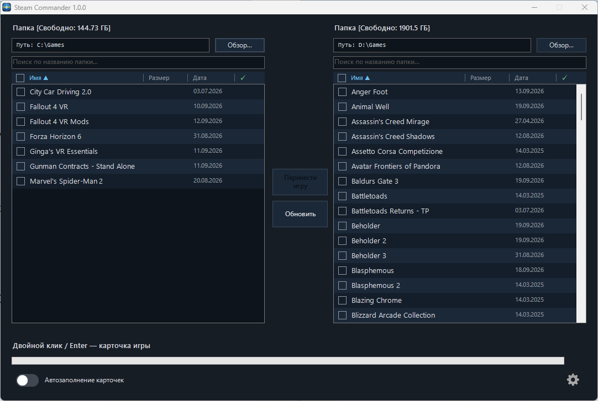
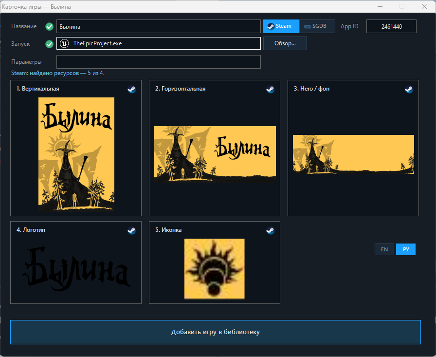
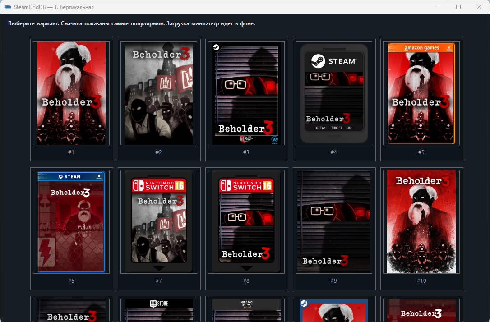
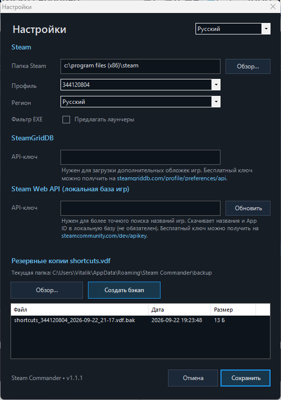

<div align="center">


# Steam Commander

**Удобное, быстрое и автоматическое добавление сторонних игр в библиотеку Steam: автопоиск exe и параметров запуска, выбор обложек из разных источников (по возможности локализованных), двухпанельный режим для перемещения папок с играми с автоматическим обновлением путей в Steam.**


[](https://github.com/Hetfield1985/Steam-Commander/releases)
---
[](https://github.com/Hetfield1985/Steam-Commander/releases/latest)

[English](README.md) · **Русский**

</div>

<p align="center">
  
</p>

## Screenshots

<p align="center">
  
</p>

<p align="center">
  
</p>

<p align="center">
  
</p>

<p align="center">
  
</p>
---

## Что это

Steam Commander — настольная программа для Windows (Windows Forms), написанная на PowerShell. Вы указываете одну или две папки с играми (например, большой HDD и быстрый SSD), а программа помогает:

- **Добавлять сторонние игры в Steam** — с правильным названием, exe-файлом, рабочей папкой, параметрами запуска и полным набором обложек, а не пустым ярлыком.
- **Подбирать обложки** — официальные из Steam, а если их нет — из [SteamGridDB](https://www.steamgriddb.com/).
- **Переносить игры между двумя папками и дисками** — файлы перемещаются с индикацией прогресса, ярлык в Steam обновляется на новый путь.
- **Не бояться сбоев** — резервная копия и восстановление `shortcuts.vdf` в любой момент.

## Возможности

**Список игр**
- Две независимые панели, каждая для любой папки.
- Поиск по названию папки, сортировка, расчёт размера папок.
- Свободное место на диске и отметка игр, которые уже есть в библиотеке Steam.
- Колонки «Размер», «Дата», «В библиотеке»; сортировка по клику на заголовок.

**Добавление игр**
- Карточка игры: название, exe, рабочая папка, параметры запуска.
- Четыре слота обложек: **вертикальная**, **горизонтальная**, **фон (hero)**, **логотип** — с предпросмотром и значком источника (Steam / SteamGridDB).
- Индикаторы уверенности для названия и exe (зелёная галочка, когда совпадение надёжное).
- Поиск exe с отсевом мусора (деинсталляторы, обработчики сбоев, редистрибутивы и т. п.) и подсказка из собственных данных запуска Steam.
- Подсказки по параметрам запуска из данных Steam и расшифровка известных параметров.
- **Пакетное добавление** нескольких игр сразу и необязательное **автозаполнение**: уверенно распознанные игры добавляются без карточки, карточка открывается только для тех, что не удалось определить однозначно.
- Выбор **региона обложек** Steam (локализованные обложки).

**Перенос игр**
- Перенос отмеченных игр из папки одной панели в папку другой с прогрессом, скоростью и проверкой свободного места.
- Ярлыки Steam переписываются на новое расположение.

**Безопасность**
- Ручная резервная копия и восстановление `shortcuts.vdf` (Steam при восстановлении закрывается и запускается заново автоматически).
- Удаление игры из списка панели никогда не трогает файлы на диске.

**Интерфейс**
- Шесть языков: Русский, English, 简体中文, Español, Português (Brasil), Deutsch.
- Управление с клавиатуры: см. [Горячие клавиши](#горячие-клавиши).

## Требования

- Windows 10 или 11.
- Windows PowerShell 5.1 (входит в систему) — нужен только если запускаете `.ps1` напрямую.
- Установленный Steam, запущенный хотя бы один раз (чтобы появился профиль в `userdata`).
- **Права администратора** — программа запрашивает их и без них завершается.
- Доступ в интернет для поиска игр и обложек (см. [Конфиденциальность и сеть](#конфиденциальность-и-сеть)).
- По желанию (но настоятельно рекомендуется): бесплатный [API-ключ SteamGridDB](https://www.steamgriddb.com/profile/preferences) для источника SteamGridDB.

## Установка

### Вариант A — готовый exe
1. Откройте страницу [Releases](../../releases) и скачайте `Steam Commander.exe`.
2. Положите файл в любую папку и запустите (потребуются права администратора).

### Вариант B — запуск скрипта
```powershell
# из PowerShell, запущенного от имени администратора
powershell -ExecutionPolicy Bypass -File .\src\Steam_Commander.ps1
```

### Вариант C — собрать exe самостоятельно
См. раздел [Сборка](#сборка).

## Быстрый старт

1. Запустите Steam Commander и откройте **Настройки**. Проверьте папку Steam и выберите **профиль** Steam (`userdata`), с которым будете работать.
2. *(По желанию, но настоятельно рекомендуется)* Вставьте API-ключ SteamGridDB. Под полем появится статус: ключ рабочий, отозван или сервис недоступен.
3. Выберите папку с играми для левой панели и, если хотите переносить игры между дисками, вторую папку для правой панели.
4. Отметьте нужные игры и нажмите **Добавить выбранные игры в библиотеку** либо откройте одну карточку двойным кликом / Enter.
5. Проверьте название, exe и обложки, затем сохраните.

> **Важно:** при записи в `shortcuts.vdf` программа закрывает Steam и запускает его заново. Закройте запущенные игры и дождитесь окончания синхронизации Steam.

## Горячие клавиши

Обе панели используют одни и те же клавиши.

| Клавиша | Действие |
|---|---|
| Двойной клик / **Enter** | Открыть карточку игры |
| **Пробел** | Показать размер папки |
| **Delete** | Убрать выбранные игры из списка (файлы на диске не трогаются) |
| **Ctrl+A** | Выделить всё |
| **Esc** | Закрыть текущую карточку (как «Отмена») |

Кнопка **Обновить** возвращает убранные строки.

## Где хранятся данные

| Что | Где |
|---|---|
| Настройки (`config.ini`), метаданные источников обложек | `%APPDATA%\Steam Commander` |
| Резервные копии `shortcuts.vdf` (по умолчанию) | папка `backups` рядом с exe — меняется в Настройках |
| Временные обложки | `%TEMP%\SteamCommander` (удаляются при закрытии программы) |
| Ярлыки и обложки Steam | ваш профиль Steam: `Steam\userdata\<id>\config\shortcuts.vdf` и `config\grid\` |

API-ключ SteamGridDB хранится в `config.ini` **в открытом виде**. Не передавайте этот файл другим.

## Конфиденциальность и сеть

Телеметрии нет. Программа обращается только к сервисам, необходимым для работы:

- `store.steampowered.com`, `api.steampowered.com` и CDN `*.steamstatic.com` — поиск игр и официальные обложки.
- `api.steamcmd.net` — данные запуска Steam (подсказки по exe и параметрам).
- `www.steamgriddb.com` — альтернативные обложки (только при наличии вашего API-ключа).

## Сборка

Exe собирается с помощью [ps2exe](https://github.com/MScholtes/PS2EXE):

```powershell
Install-Module ps2exe -Scope CurrentUser   # один раз
.\build\build.ps1
```

Результат — `dist\Steam Commander.exe` с иконкой, версией и манифестом администратора. Версия берётся из `$global:appVersion` в скрипте, поэтому всегда совпадает с исходником.

Workflow GitHub Actions (`.github/workflows/release.yml`) собирает exe и прикрепляет его к релизу при пуше тега вида `v1.0.0`.

## Структура проекта

```
Steam-Commander/
├── src/Steam_Commander.ps1      # всё приложение
├── build/build.ps1              # скрипт сборки через ps2exe
├── assets/icon/                 # иконка (.ico, PNG 1024 и 4096 px)
├── .github/                     # шаблоны issue, workflow релиза
├── CHANGELOG.md
├── CONTRIBUTING.md
└── LICENSE
```

## Известные ограничения

- Для некоторых игр (особенно очень новых или малоизвестных) на CDN Steam нет вертикальной обложки. Тогда запасной источник — SteamGridDB, для него нужен API-ключ.
- Сопоставление названий игр эвристическое. Индикаторы уверенности в карточке подсказывают, когда стоит проверить вручную.
- Поддерживается только Windows.

## Участие в проекте

Отчёты об ошибках и pull request'ы приветствуются — см. [CONTRIBUTING.md](CONTRIBUTING.md).

## Отказ от ответственности

Steam Commander — неофициальный общественный инструмент. Он не связан с Valve Corporation, не одобрен и не спонсируется ею. *Steam* и логотип Steam — товарные знаки Valve Corporation. Обложки, показываемые в программе, берутся из Steam и SteamGridDB и принадлежат их владельцам. Иконка приложения — оригинальная разработка.

Используйте на свой риск: программа изменяет файл Steam `shortcuts.vdf`. Перед первой массовой операцией создайте резервную копию в окне настроек.

## Лицензия

[MIT](LICENSE)
