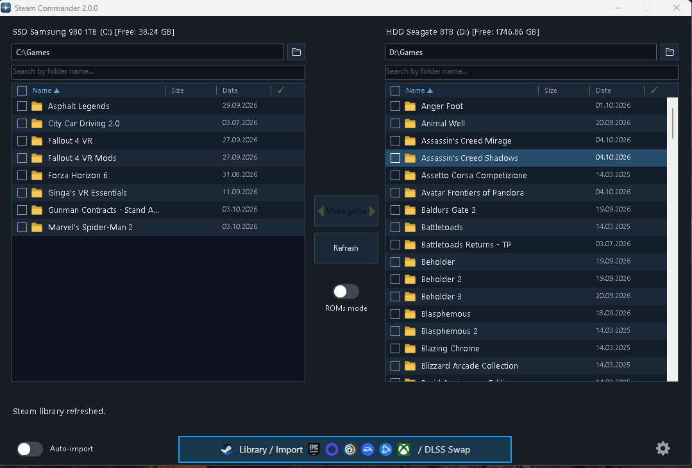
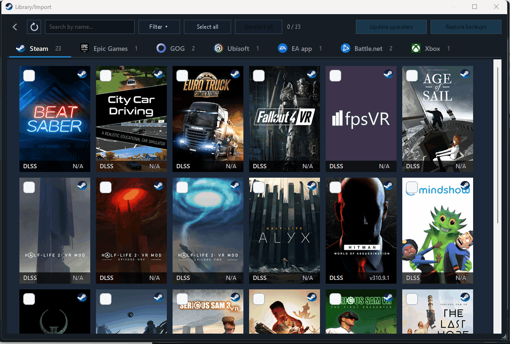
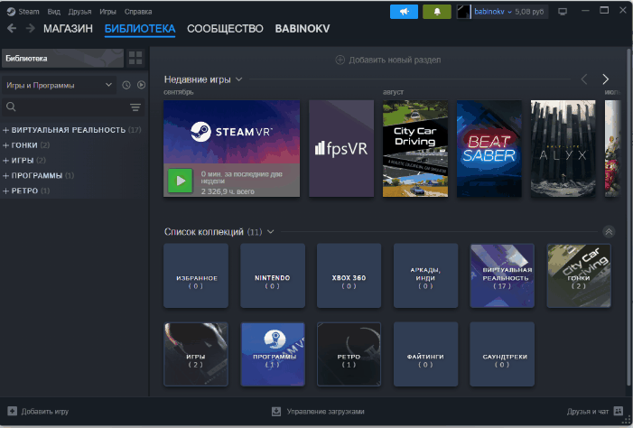
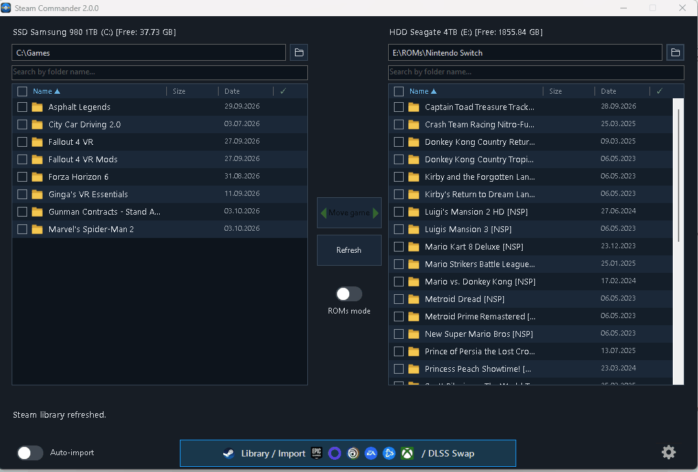
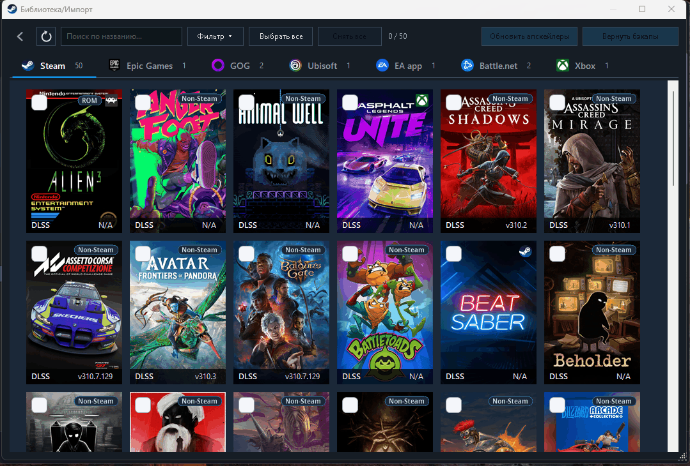
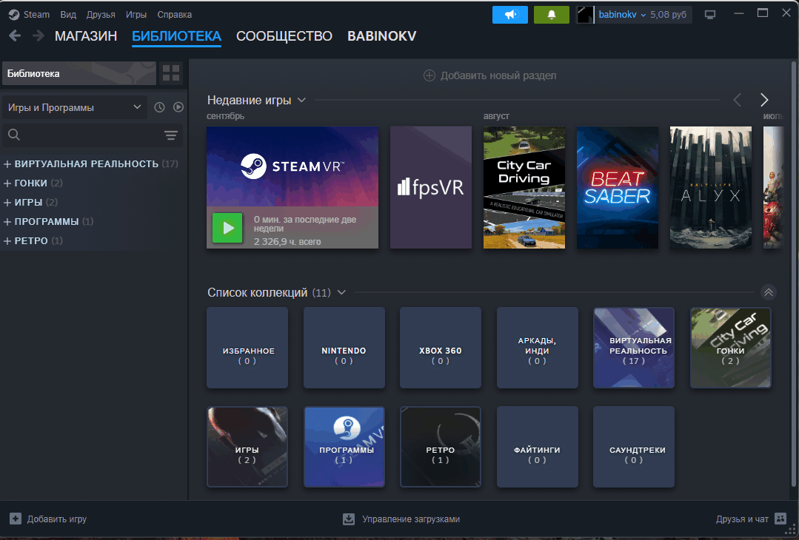

<div align="center">


# Steam Commander

**Добавляйте сторонние игры и ROM-ы в Steam, импортируйте библиотеки Epic / GOG / Ubisoft / EA / Battle.net / Xbox, ставьте обложки (официальные из steam или пользовательские SteamGridDB), настраивайте запуск и обновляйте DLSS / FSR / XeSS / XeLL, переносите игры между разными источниками в удобной панели — всё в одной программе.**


[](https://github.com/Hetfield1985/Steam-Commander/releases)

---

[](https://github.com/Hetfield1985/Steam-Commander/releases/latest)

<p align="center">
  <a href="https://donatty.com/vitalibabinok"></a>
  <a href="https://destream.net/live/VitaliBabinok"></a>
  <a href="https://boosty.to/babinok/donate"></a>
  <a href="#поддержка"></a>
</p>

<p align="center">
  <b>Русский</b> · <a href="README.md">English</a>
</p>

---

</div>

## Что умеет программа

### Добавление игр в Steam

Добавление в библиотеку Steam Non-Steam игр с автоматическим определением названия игры, EXE файла, удобного выбора официально доступных параметров запуска (или указанием своих) и полным набором обложек из двух выбираемых источников (Steam + SteamGridDB). Пакетное добавление с автозаполнением всех данных, в которых программа уверена, при не уверенном определении спрашивает у пользователя недостоющие данные. Встроенная база названий игр Steam — нужна для более точного поиска, содержит данные всех игр на момент создания программы, для точого поиска новых игр, рекомендуется получить и указать в программе свой Steam Web API-key (подробности в настройках).

<p align="center">
  
</p>

### Импорт из лаунчеров

Epic Games, GOG Galaxy, Ubisoft Connect, EA App, Battle.net, Xbox. Импорт отмеченных игр в Steam (ручной и автоматический). Кастомизация обложек так же доступна. Для запуска используется собственный тихий лаунчер, который следит за тем чтобы сторонний лаунчер запускался в тихом режиме, переводит фокус игры и закрывает сторонний лаунчер после закрытия игры, у вас будет ощущение что вы играете в игру Steam а не в стороннем лаунчере.

<p align="center">
  
</p>

### Автоматический импорт

Для тех кто экономит время, при включении опции автоимпорта, можно добавлять игры в огромных количествах за очень быстрое время без участия в процессе. От пользователя требуется только уточнить данные которые программа не смогла определить с уверенностью. 

<p align="center">
  
</p>

### Добавление ROM-ов и с выбором эмулятора. 

Панели показывают папки и ROM-файлы по расширениям активного эмулятора. Менеджер эмуляторов, поддержка RetroArch с выбором ядра, архивы (zip, 7z, rar и др.) с распаковкой во временную папку, установка своих параметров эмуляторов, напримр для запуска в полноэкранном режиме. 

<p align="center">
  
</p>

### Обновление и управление библиотеками апскейлеров

Скачивание и выбор версий DLSS / FSR / XeSS / XeLL. Замена библиотек в выбранных играх либо во всех добавленных одной кнопкой. Оригиналы сохраняются как `.sc_orig`, восстановление одним действием.

<p align="center">
  
</p>

### Двухпанельный браузер

Две независимые панели (любые папки / диски). Поиск, сортировка, размер папок, отметка «уже в Steam» со значком игры. Перемещение папок игр, ромов между панелями с прогрессом и обновлением ярлыков Steam. Умное перемещения сразу в обе стороны между папками/дисками (выберите игры сразу на обоих панелях и нажмите пробел чтобы узнать возможность перемещения).

<p align="center">
  
</p>

### Редактирование библиотеки

Редактирование non-Steam, ROM-ов и лицензионных Steam-игр (обложки, параметры запуска). Автоматическое и ручное резервное копирование и восстановление `shortcuts.vdf`(файл в котором находится библиотека сторонних игр).

<p align="center">
  
</p>

---

## Системные требования

- Windows 10 или 11
- Windows PowerShell 5.1 (только при запуске `.ps1`)
- Установленный Steam (хотя бы один раз запущенный)
- **Права администратора**
- Интернет — для поиска игр, обложек и скачивания апскейлеров
- Необязательно но рекоменловано: [Steam Web API ключ](https://steamcommunity.com/dev/apikey) и настоятельно рекомендовано [SteamGridDB API ключ](https://www.steamgriddb.com/profile/preferences) для выбора пользовательских обложек.
- Для ROM-архивов: 7-Zip (программа может предложить скачать)

---

## Установка

### Готовый exe
1. Скачайте `Steam Commander.exe` со страницы [Releases](../../releases)
2. Запустите (программа запросит права администратора)

### Скрипт
```powershell
# PowerShell от имени администратора
powershell -ExecutionPolicy Bypass -File .\src\Steam_Commander.ps1
```

### Сборка exe
```powershell
Install-Module ps2exe -Scope CurrentUser   # один раз
.\build\build.ps1
```
Результат — `dist\Steam Commander.exe`.

---

## Первоначальная настройка

1. Откройте **Настройки** → укажите папку Steam и профиль `userdata`
2. *(По желанию)* Добавьте Steam Web API и SteamGridDB API ключи
3. При необходимости добавьте эмуляторы и скачайте библиотеки апскейлеров в настройках программы.
4. Добавьте профили эмуляторов с указанием exe.

> При записи в `shortcuts.vdf` программа закрывает Steam и запускает его снова. Перед операцией закройте игры и дождитесь синхронизации Steam.

---

## Горячие клавиши

| Клавиша | Действие |
|---|---|
| Двойной щелчок / **Enter** | Открыть карточку игры |
| **Space** | Размер папок отмеченных игр, а тек же узнать возможность переноса этих игр между панелями |
| **Ctrl+A** | Выбрать все папки и файлы в панели. |
| **Esc** | Закрыть карточку игры |
| **Alt+Shift+Enter** | Размер всех папок панели |
| **F5** | Обновить панели / окно библиотеки|

---

## Где хранятся данные

| Что | Где |
|---|---|
| Настройки, профили эмуляторов | `%APPDATA%\Steam Commander` |
| База игр Steam | `%APPDATA%\Steam Commander\steam_apps_db.json` |
| Библиотеки апскейлеров | `%APPDATA%\Steam Commander` |
| Языковые файлы | `%APPDATA%\Steam Commander\lang` |
| Резервные копии `shortcuts.vdf` | папка `backups` рядом с exe |
| Временные файлы | `%TEMP%\SteamCommander` |
| Ярлыки и обложки Steam | `Steam\userdata\<id>\config\` |

Ключи API хранятся в открытом виде в `config.ini` — не передавайте этот файл.

---

## Конфиденциальность и сеть

Телеметрии нет. Программа обращается только к:

- `store.steampowered.com`, `api.steampowered.com`, `*.steamstatic.com`
- `api.steamcmd.net`
- `www.steamgriddb.com` (при наличии ключа)
- источникам библиотек апскейлеров dlss swapper

---

## Структура проекта

```text
Steam-Commander/
├── src/Steam_Commander.ps1
├── build/build.ps1
├── assets/icon/
├── .github/
├── CHANGELOG.md
├── CONTRIBUTING.md
└── LICENSE
```

---

## Известные ограничения

- Для новых или малоизвестных игр обложки Steam могут отсутствовать — помогает поиск по базам SteamGridDB
- Сопоставление названий эвристическое; индикаторы уверенности подсказывают, когда нужно даннные проверить вручную
- Импорт из лаунчеров зависит от формата данных конкретного лаунчера
- Только Windows

---

## Участие в разработке

Ошибки и pull request приветствуются — см. [CONTRIBUTING.md](CONTRIBUTING.md).  
Можно добавлять языковые файлы в папку `lang`.

---

## Отказ от ответственности

Steam Commander — неофициальный проект сообщества. Не связан с Valve Corporation.  
*Steam* и логотип Steam — товарные знаки Valve Corporation.  
Обложки принадлежат их владельцам. Иконка приложения — оригинальный дизайн.

Программа изменяет `shortcuts.vdf` и может заменять DLL апскейлеров. Используйте на свой страх и риск. Перед массовыми операциями создайте резервную копию.

---

## Лицензия

[MIT](LICENSE)

---

## Поддержка

Если программа оказалась полезной:

- [Donatty](https://donatty.com/vitalibabinok)
- [DeStream](https://destream.net/live/VitaliBabinok)
- [Boosty](https://boosty.to/babinok/donate)

**USDT** (минимум 5 USDT):

- ERC-20: `0x2503cdb205ac6e41222e114d77b0dcc48ed83686`
- TRC-20: `TSE4BZQC6h9qES2QsgJjcfyDbGYNDATSv4`
- BEP-20: `0x2503cdb205ac6e41222e114d77b0dcc48ed83686`

Отправляйте только через указанную сеть. Переводы меньше 5 USDT или через другую сеть будут потеряны.
